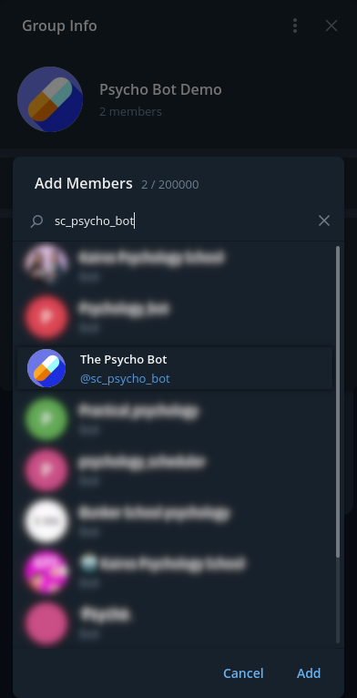

<h1 align="center">
    <br>
    <a href="https://stevancorre.github.io/telegram-psychobot/">
        
    </a>
    <br>
    Telegram Psychobot
    <br>
</h1>

<h4 align="center">Telegram bot that give you informations about psychoactive substances.</h4>

<p align="center">
    <a href="https://nodejs.dev">
        
    </a>
    <a href="https://www.typescriptlang.org">
        
    </a>
    <a href="https://telegram.org/">
        
    </a>
    <a href="https://psychonautwiki.org">
        
    </a>
    <a href="https://paypal.me/aiixu">
        
    </a>
</p>

<p align="center">
    <a href="https://stevancorre.github.io/telegram-psychobot">Docs</a> •
    <a href="#how-to-invite">Invite me</a> •
    <a href="#how-to-host">Host it</a> •
    <a href="#license">License</a> •
    <a href="#credits">Credits</a>
</p>

**This project is not hosted yet, but will be soon**

This bot is a Telegram bot originally made for the group [Parlons Conso](https://t.me/parlons_conso), a french anonymous discussion group made by and for consumers of psychoactive substances. <br>
It is now meant to be used in a larger context.

This project is based on the [Dosebot Discord Bot](https://github.com/dosebotredux/DosebotRedux).

<br>

## How to invite

1. Go to the group info screen and hit the `Add member` button  
2. Then search for `@sc_psycho_bot`  

3. Click `Add`, and voilà!  

<br>

## How to host

### Clone the repo
```console
$ git clone https://github.com/stevancorre/telegram-psychobot.git
```

### Grab a bot token

You can do that here: [core.telegram.org/api](https://core.telegram.org/api).  
It should looks like `123456:ABC-DEF1234ghIkl-zyx57W2v1u123ew11`. <br>

Then, create a `.env` file in the project's folder and type:
```
TOKEN=<your bot token here>
```

### Install dependencies

Now, you have to install all dependencies:
```console
$ npm ci
```

### Build and run

```
# Build
$ npm run build

# Build an start
$ run run start
```

<br>

## License

This project is <a href="https://opensource.org/licenses/MIT">MIT</a> licensed.

<br>

## Credits

- Icon: <a href="https://www.flaticon.com/free-icons/pill" title="pill icons">Pill icons created by Freepik - Flaticon</a>
- README design: <a href="https://github.com/amitmerchant1990/electron-markdownify/blob/master/README.md">github.com/amitmerchant1990</a>
- Dosebot: <a href="https://github.com/dosebotredux">github.com/dosebotredux</a>
- Psychonaut Wiki: <a href="https://psychonautwiki.org">psychonautwiki.org</a> • <a href="https://psychonautwiki.org/wiki/Donate">Make a donation</a>